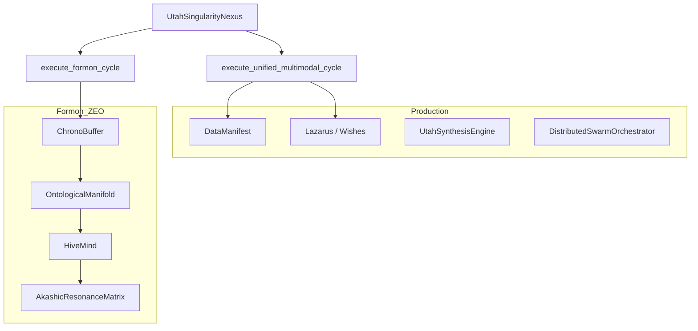

# utahML Architecture

This document maps modules, execution paths, and how production APIs relate to ZEO-Architect / Formon layers.

## Package layout

| Module | Role |
|--------|------|
| `utah.core` | `UtahApp`, `UtahSingularityNexus`, `UtahCore`, `OntologicalManifold`, hardware helpers, **orchestration entrypoints** |
| `utah.lazarus` | Self-healing (`LazarusDaemon`), wishes watcher, immunity, codegen synthesizer |
| `utah.directives` | Intent → engine blueprint (`IntentDirectiveResolver`, context harvest) |
| `utah.data` | `DataManifest`, `StreamVector`, sources (CSV/JSONL/binary) |
| `utah.forge` | Synthesis engine, ontological forge, deploy CLI, `HardwareBridge` |
| `utah.memory` | `SequenceContextStore`, `EpistemicReactor`, **`ChronoBuffer`** |
| `utah.perception` | Vision processors, **`HolographicLens`**, overlay broadcast |
| `utah.swarm` | `CognitiveSwarm`, async orchestrator, **`HiveMind`**, `EntanglementTensor` |
| `utah.acoustic` | Waveform/spectral encoders, cymatic resonator |
| `utah.evolution` | Genomes, topological pool, negentropic catalyst |
| `utah.stenographer` | JSONL telemetry, holographic stenographer |
| `utah.akashic_matrix` | **`AkashicResonanceMatrix`** knowledge precipitation |
| `utah.migrate` | Legacy project scaffolding |

Importing `utah` runs `LazarusDaemon.ignite()` by default (global excepthook healing).

## Two orchestration paths

### Path A — `execute_unified_multimodal_cycle` (production glue)

Best for: wiring directives, telemetry, and optional `DataManifest` without ZEO layers.

```
Input payload { intent, data?, data_manifest? }
    → IntentDirectiveResolver.manifest_preset_pipeline
    → HighDensityTelemetryLogger.log_vector_event
    → { status, assigned_engine, internal_parameters, processed_data_hash }
```

### Path B — `execute_formon_cycle` (unified Formon / SOTA)

Best for: demos, integration tests, and one-call traversal of acausal + ontological + swarm + akashic stack.

```
Input payload { intent, data? }
    → ChronoBuffer.retroject_logic + get_akashic_snapshot
    → OntologicalManifold.precipitate_solution (via UtahCore)
    → HiveMind.observe_and_adapt + synchronize (EntanglementTensor)
    → AkashicResonanceMatrix.precipitate_knowledge
    → HighDensityTelemetryLogger + IntentDirectiveResolver
    → rich manifest dict
```

See: `docs/tutorials/07-formon-cycle-pipeline.md` and `docs/technical/conventional-vs-utahml.md`.

## Layer model



## Component registration

`UtahSingularityNexus._initialize_core_infrastructure()` registers:

- `directives`, `stenographer`, `lazarus`
- `chrono_buffer`, `ontological_core`, `hive_mind`, `akashic_matrix`

Additional nodes bind via `bind_processing_node(domain, instance)`.

## Comparison and migration docs

- **Conventional vs utahML (code comparisons):** `docs/technical/conventional-vs-utahml.md`
- **Linter → wishes migration:** `docs/technical/migration-from-linters.md`
- **Enterprise view:** `docs/technical/enterprise-architecture.md`

## Versioning

Package version is declared in `setup.py`. Release process: `RELEASING.md`.
